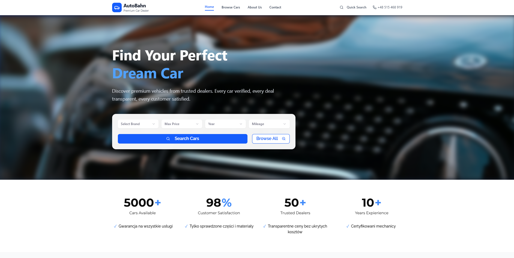
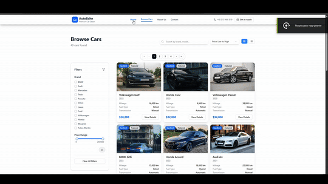
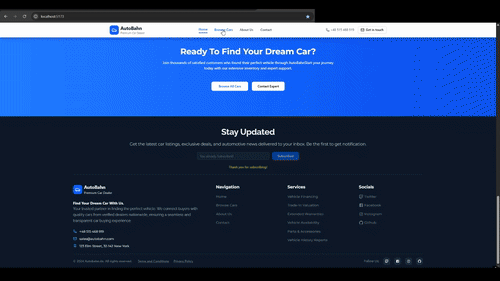
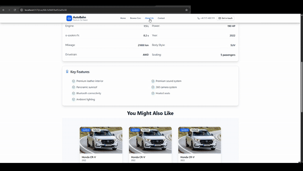
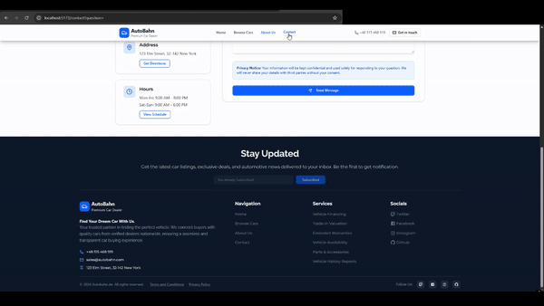
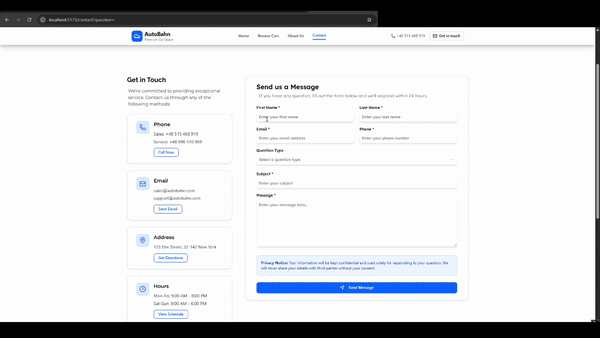
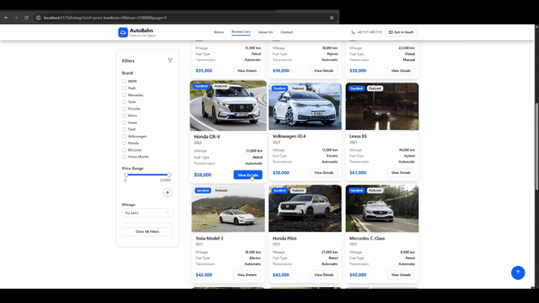
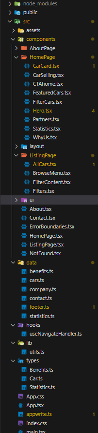
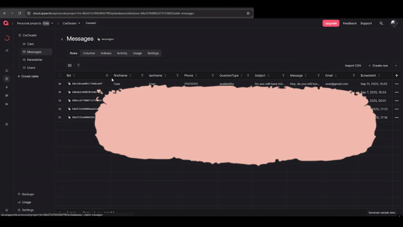
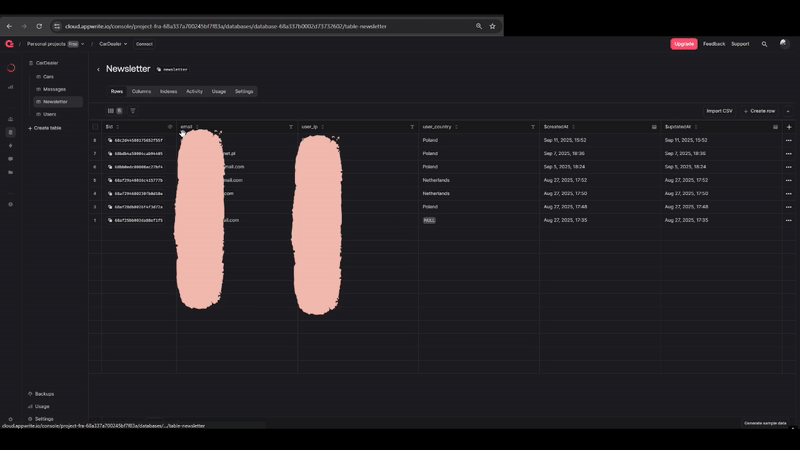

<div align="center">
  <br />
  <a href="https://github.com/Marmo77/Car-Dealer_Website">
    
  </a>
  <h3 align="center">🚗 Modern Car Dealership Platform</h3>
  <div align="center">
    A full-stack car dealership website built with React, TypeScript, and AppWrite
  </div>

  <div align="center">
    
    
    
    
  </div>
</div>
<div align="center">
 <h2>You can see working website on <a href="https://car-dealer-website-nine.vercel.app/" target="_blank">Live server</a></h2>
</div>
<br />
{*YES, readme is generated with AI :D*}
<br/>
<br/>
<h3>📋<a name="table">Table of Contents</a></h3>

<div align="left">

1. 🤖 [Introduction](#introduction)
2. 📸 [Showcase](#showcase)
3. ⚙️ [Tech Stack](#tech-stack)
4. ✨ [Features](#features)
5. 🔧 [Architecture](#architecture)
6. 🚀 [Quick Start](#quick-start)
7. 📊 [Database Schema](#database-schema)
8. 🗺️ [Roadmap](#roadmap)
9. 🧠 [Learning Journey](#learning-journey)
10. 🤝 [Contributing](#contributing)
11. 📄 [License](#license)
12. 📞 [Contact](#contact)

</div>

<br />

## <a name="introduction">🤖 Introduction</a>

<div align="center">
  <h4>Welcome to my Car Dealership Platform - A Learning-Driven Full-Stack Project</h4>
</div>

This is my **first fully finished project** and represents a significant milestone in my web development journey. What started as a spontaneous late-night coding session (2am to 5am ☠️) became a comprehensive car dealership website that taught me real database integration and modern web development practices.

<div align="center">
  
  
  
</div>

### 🎯 Project Goals

- **Learn Real Database Integration**: Move beyond "fake" databases to actual backend solutions
- **Master Modern Web Stack**: React, TypeScript, and cutting-edge tooling
- **Build Something Practical**: A functional car dealership with real-world features
- **Minimize AI Dependency**: Focus on hands-on learning and problem-solving

## <a name="showcase">📸 Showcase</a>

<div align="center">
  <h2>🎬 Project Highlights</h2>
  <div>
  <h3>Home Page </h3>
  <br/>
  
  </div>
    <div>
  <h3>Browse Page </h3>
  <br/>
  
  </div>
    <div>
  <h3>About Page </h3>
  <br/>
  
  </div>
    <div>
  <h3>Contact Page </h3>
  <br/>
  
  </div>
  <div>
  <h3>Contact Form </h3>
  <br/>
  
  </div>
  <div>
  <h3>Car Details</h3>
  <br/>
  
  </div>

  <h4>You can also see this on live server <a href="https://car-dealer-website-nine.vercel.app/">*LINK*</a></h4>

  
</div>

### 🏆 Current MVP Features

<div align="center">
  
| Feature | Status | Description |
|---------|---------|-------------|
| 🚗 **Car Listings** | ✅ Complete | Real-time data from AppWrite database |
| 🔍 **Advanced Filtering** | ✅ Complete | Filter by make, model, price, year, etc. |
| 📱 **Responsive Design** | ✅ Foundation | Clean UI with Tailwind CSS & shadcn |
| ⚡ **Fast Performance** | ✅ Optimized | Vite build system for lightning-fast loads |
| 🔗 **Database Queries** | ✅ Advanced | Complex query merging & conditional arrays |
| ✉️ **Contact Form** | ✅ Complete | A contact form that transfers data to the database  |

</div>

### 📱 Code Snippets & Structure

<div align="center">
  
*Advanced TypeScript implementations and clean folder architecture*



</div>

<br />

## <a name="tech-stack">⚙️ Tech Stack</a>

<div align="center">
  
### 🎨 Frontend Technologies

<div align="center">
  
  
  
  
  
</div>

### 🔧 Backend & Database

<div align="center">
  
  
</div>

### 🛠️ Development Tools

<div align="center">
  
  
  
</div>

</div>

<br />

## <a name="features">✨ Features</a>

<div align="center">
  <h4>🎯 MVP (Minimum Viable Product)</h4>
</div>

### ✅ **Completed Features**

<div align="left">

- **🔗 Car Database Integration**: Real-time data fetching from AppWrite database
- **🚗 Car Display System**: Clean presentation of car listings with essential details  
- **🔍 Advanced Filtering System**: Filter cars by make, model, price range, year, and more
- **📱 Responsive Base Layout**: Mobile-friendly design foundation
- **⚡ Database Query Optimization**: Advanced query merging and conditional operations
- **🎨 Modern UI Components**: Clean interface using Tailwind CSS and shadcn/ui
**📄 Car Details Pages**: Individual car pages with complete specifications (`/car/{car_id}`)
  - **ℹ️ About Page**: Company information and dealership details
 - **📱 Completed Mobile Responsiveness**: Enhanced mobile experience
- **❤️ Favorites System**: User wishlist functionality (localStorage)
- **📧 Newsletter Management**: Email subscription handling

</div>

### 🔨 **In Progress**

<h5>Now is a break from the project, but definitelly I will start with optimizing Performance and Admin CRUD</h5>

</div>

### 🗺️ **Planned Features**

<div align="left">

- **🔐 Admin Panel with CRUD**: Complete car management system
- **🖼️ Image Gallery**: Multiple images per car listing
- **⭐ User Reviews**: Rating and review system

</div>

<br />

## <a name="architecture">🔧 Architecture</a>

<div align="center">
  <h4>🏗️ Project Structure & Database Design</h4>
</div>

### 📁 **Folder Structure**
```
Car-Dealer_Website/
├── src/
│   ├── components/          # Reusable UI components
│   ├── pages/              # Route components
│   ├── lib/                # Utilities and configurations
│   ├── hooks/              # Custom React hooks
│   └── types/              # TypeScript type definitions
├── public/                 # Static assets
└── ...config files
```

### 🗃️ **Database Collections**

<div align="left">

**Cars Collection** - Main inventory data
**Messages Collection** - Contact form submissions  
**Newsletters Collection** - Email subscriptions

</div>

<br />

## <a name="quick-start">🚀 Quick Start</a>

<div align="center">
  <h4>⚡ Get Started in Minutes</h4>
</div>

### 📋 **Prerequisites**

<div align="left">

- **Node.js** (v16 or higher)
- **npm** or **yarn** package manager
- **AppWrite account** (free tier available)

</div>

### 🔧 **Installation**

#### **Step 1: Clone the Repository**
```bash
git clone https://github.com/Marmo77/Car-Dealer_Website.git
cd Car-Dealer_Website
```

#### **Step 2: Install Dependencies**
```bash
npm install
```

#### **Step 3: Set Up AppWrite**

<div align="left">

1. Create an account at [AppWrite](https://appwrite.io)
2. Create a new project
3. Set up a database and collection for cars
4. Get your credentials:
   - `PROJECT_ID`
   - `DATABASE_ID` 
   - `ENDPOINT`
   - `COLLECTION_ID`

</div>

#### **Step 4: Configure Environment Variables**

Create a `.env.local` file in the root directory:

```env
VITE_APPWRITE_PROJECT_ID=your_project_id
VITE_APPWRITE_PROJECT_NAME=your_project_name
VITE_APPWRITE_DATABASE_ID=your_database_id
VITE_APPWRITE_ENDPOINT=your_endpoint 
VITE_APPWRITE_COLLECTION_ID=your_collection_id
VITE_APPWRITE_CONTACT_MESSAGE_COLLECTION_ID=your_contactMessagesCollection_id
VITE_APPWRITE_NEWSLETTER_COLLECTION_ID=your_newsletterCollection_id
```

#### **Step 5: Run the Development Server**
```bash
npm run dev
```

<div align="center">
  🎉 **The application will be available at** `http://localhost:5173`
</div>

<br />

## <a name="database-schema">📊 Database Schema</a>

<div align="center">
  <h4>🗃️ AppWrite Database Structure</h4>
</div>

### 🚗 **Cars Collection**
<div align="center">
  
 
</div>

### 📧 **Messages Collection**
<div align="center">
 
</div>

### 📰 **Newsletters Collection**
<div align="center">
  
 
</div>

<br />

## <a name="roadmap">🗺️ Roadmap</a>

<div align="center">
  <h4>🎯 Development Phases</h4>
</div>

### **Phase 1: Core Improvements** 🔨

<div align="left">

- ✅ Implement About page
- ✅ Add car detail pages  
- ✅ Improve error handling
- ✅ Complete mobile responsiveness

</div>

### **Phase 2: User Features** 🎨

<div align="left">

- ✅ Favorites/Wishlist functionality (localStorage)
- ✅ Newsletter and contact form management
- ✅ Advanced search and sorting options

</div>

### **Phase 3: Advanced Features** 🚀 *(Current)*

<div align="left">

- 🔄 Admin panel with full CRUD operations
- 🔄 Car inventory management system
- 🔄 User reviews and ratings system
- 🔄 Multi-image upload system

</div>

### **Phase 4: Performance & Polish** ✨

<div align="left">

- 🔄 SEO optimization
- 🔄 Performance improvements  
- 🔄 Advanced animations (Framer Motion)
- 🔄 PWA capabilities

</div>

<br />

## <a name="learning-journey">🧠 Learning Journey</a>

<div align="center">
  <h4>💡 Key Learnings & Insights</h4>
</div>

### 🎓 **Technical Skills Developed**

<div align="left">

- **Database Integration Mastery**: Real-world AppWrite implementation
- **Advanced Query Techniques**: Complex data filtering and conditional arrays
- **TypeScript Proficiency**: Strong typing and modern JavaScript patterns
- **React Modern Patterns**: Hooks, context, and component composition
- **CSS Framework Expertise**: Tailwind CSS and component libraries
- **Environment Configuration**: API keys and deployment preparation

</div>
<h3><a href="https://car-dealer-website-nine.vercel.app/" target="_blank">You can see the live working website</a></h3>
### 🌙 **The Late-Night Learning Session (2am-5am)**

<div align="center">
  
*This project taught me about persistence, problem-solving under pressure, and the satisfaction of building something real. The late-night coding session was intense but incredibly rewarding!*

</div>

### 🎯 **Project Philosophy**

<div align="left">

- **Minimal AI Dependency**: Focus on hands-on learning and understanding
- **Real-World Application**: Build practical, usable software
- **Continuous Improvement**: Iterative development and feature enhancement
- **Clean Code Practices**: Readable, maintainable, and scalable codebase

</div>

<br />

## <a name="contributing">🤝 Contributing</a>

<div align="center">
  <h4>🌟 Join the Development Journey</h4>
</div>

This is primarily a learning project, but contributions are welcome! Here's how you can help:

### 🔄 **Contribution Process**

```bash
# 1. Fork the repository
# 2. Create a feature branch
git checkout -b feature/amazing-feature

# 3. Commit your changes  
git commit -m 'Add amazing feature'

# 4. Push to the branch
git push origin feature/amazing-feature

# 5. Open a Pull Request
```

### 🎯 **Areas for Contribution**

<div align="left">

- 🐛 **Bug Fixes**: Help identify and resolve issues
- 🎨 **UI/UX Improvements**: Enhanced design and user experience
- 📱 **Mobile Responsiveness**: Better mobile optimization
- ⚡ **Performance Optimizations**: Speed and efficiency improvements
- 📖 **Documentation**: Improve guides and code comments

</div>

<br />

## <a name="license">📄 License</a>

<div align="center">
  
This project is open source and available under the **MIT License**.

<div align="center">
  
</div>

</div>

<br />

## <a name="contact">📞 Contact</a>

<div align="center">
  <h4>🌐 Let's Connect</h4>
</div>

<div align="center">

**Marmo77** - *Full-Stack Developer & Learner*

[](https://github.com/Marmo77)

**Project Repository**: [Car-Dealer_Website](https://github.com/Marmo77/Car-Dealer_Website)

</div>

---

<div align="center">
  <h4>⭐ If you found this project helpful, please give it a star!</h4>
  <p><em>Built with ❤️ and lots of late-night coding sessions</em></p>
</div>
